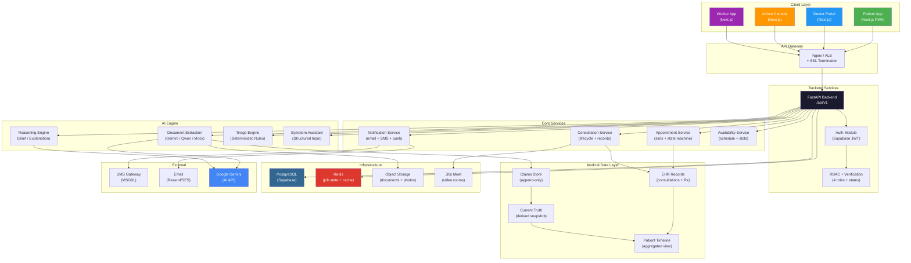

# SETU — Complete Product Completion Roadmap

> **Based on**: Full codebase analysis of `r:\Setu` — 17 DB models, 20 API routers, 25+ services, 4 frontend portals (patient/doctor/admin/worker), Docker-compose infra, Supabase auth integration.
>
> **Date**: June 17, 2026 | **Demo target**: June 20 | **Production target**: TBD

---

## Part 1: Current Product Maturity Assessment

### Overall Score: **35–40% of production readiness**

The codebase is a well-architected **prototype** with strong foundations in medical document processing, AI-powered extraction, and compliance primitives. However, it is **not yet a usable healthcare product** — it lacks the complete user workflows that real patients and doctors need.

### Detailed Assessment by Area

| Area | Maturity | Assessment |
|------|----------|------------|
| **1. Authentication & User Mgmt** | 🟡 55% | Supabase phone-OTP works. RBAC exists (4 roles). No doctor verification workflow, no profile completion, no account states. |
| **2. Doctor Management** | 🔴 20% | Minimal Provider model (5 fields). No availability, no scheduling, no consultation fees, no verification status, no credential upload. Dashboard shows only pending requests. |
| **3. Appointment Booking** | 🟡 40% | State machine is solid (6 states, role-gated transitions). No availability/slot system, no doctor search, no time-slot selection, no double-booking prevention, no rescheduling. |
| **4. Telemedicine Workflow** | 🔴 15% | Jitsi room name generation only (`setu-{patient_id}-{brief_id}`). No pre/during/post consultation lifecycle. No doctor notes, no in-consultation prescription, no session recording. |
| **5. Medical Records** | 🟡 45% | Excellent claims/current-truth architecture. AI extraction pipeline works. No structured encounters, no consultation-linked records, no patient timeline, no lab results management. |
| **6. AI Features** | 🟡 50% | Extraction (Gemini/mock), brief generation, explanation, triage engine, priority scoring are implemented. No symptom assistant, no risk prediction, no doctor-side AI assistance. |
| **7. Notifications** | 🔴 10% | Reminder model exists (schedule-of-record). No actual delivery — no email, no SMS, no push, no WhatsApp. Telegram bot exists but is down in India. |
| **8. Security & Compliance** | 🟡 50% | DPDP consent gateway, audit logging, data retention/purge, document hashing. No encryption at rest, no field-level encryption, no comprehensive RBAC audit, no consent versioning. |
| **9. Infrastructure** | 🟡 35% | Docker-compose works. No CI/CD, no automated testing pipeline, no monitoring, no centralized logging, no backup strategy, no scaling plan. |

---

### What IS Built (Strengths)

```
✅ AI Document Pipeline    extraction → validation → memory → explanation → brief → share
✅ Claims Architecture     Append-only claims + derived CurrentTruth (medical-grade data model)
✅ 4-Role RBAC             patient | provider | health_worker | admin (in Supabase app_metadata)
✅ Appointment State Machine  requested → accepted → confirmed → completed (+ declined/cancelled)
✅ Triage Engine            Deterministic rules, no AI diagnosis (SaMD-safe)
✅ Consent Gateway          DPDP-compliant, blocks processing without consent
✅ Audit Logging            AccessLog table with actor/action/resource/IP
✅ Data Retention           Auto-purge raw images, keep claims + hash (DPDP erasure)
✅ Multilingual Support     Marathi, Hindi, English (reasoning + summaries)
✅ Health Worker Proxy      Register patients, upload documents, create shares
✅ Vitals Recording         blood_pressure, blood_sugar, spo2, heart_rate with flagging
✅ Frontend Portals         4 separate route groups: (patient), (doctor), (admin), (worker)
✅ Phone OTP Login          Supabase-based with portal-aware redirects
```

---

## Part 2: Architecture Problems

### CRITICAL (Will break in production)

#### P2-1: No Doctor Availability/Slot System

**Problem**: Appointments can be created for any specialty at any time. There is no availability model — no way to know when a doctor is free. Double-booking is possible.

**Files affected**:
- [models.py](file:///r:/Setu/apps/api/app/db/models.py) — No `DoctorAvailability` or `TimeSlot` model
- [appointments.py (service)](file:///r:/Setu/apps/api/app/services/appointments.py) — `book()` creates appointment without checking availability
- [appointments_router.py](file:///r:/Setu/apps/api/app/routers/appointments_router.py) — No slot selection endpoint

#### P2-2: No Doctor Verification Workflow

**Problem**: Admin can grant provider role via phone number ([admin_providers_router.py](file:///r:/Setu/apps/api/app/routers/admin_providers_router.py#L42-L76)), but there's no verification status, no credential upload, no approval workflow. Any phone number granted provider role can immediately see patient data.

**Files affected**:
- [models.py](file:///r:/Setu/apps/api/app/db/models.py#L210-L224) — `Provider` has no `verification_status`, `credentials`, `license_number`
- [supabase_admin.py](file:///r:/Setu/apps/api/app/services/supabase_admin.py#L120-L127) — `ensure_user_with_role()` grants role immediately

#### P2-3: No Consultation Session Model

**Problem**: When an appointment status changes to "completed", nothing happens. There's no record of what happened during the consultation — no doctor notes, no diagnosis, no prescription, no follow-up linkage.

**Files affected**:
- [models.py](file:///r:/Setu/apps/api/app/db/models.py#L227-L257) — `Appointment` has `notes` (single string) but no `ConsultationSession` model
- [appointments.py (service)](file:///r:/Setu/apps/api/app/services/appointments.py#L70-L132) — `transition()` to `completed` has no side effects

#### P2-4: Provider Model Too Thin for Production

**Problem**: The [Provider](file:///r:/Setu/apps/api/app/db/models.py#L210-L224) model has only 6 fields: `id`, `supabase_user_id`, `phone`, `display_name`, `specialty` (singular), `facility`. A real doctor profile needs: experience, qualifications, languages, multiple specializations, consultation fee, profile photo, bio, location, rating.

#### P2-5: No Doctor-Patient Data Access Control

**Problem**: When a doctor accepts an appointment, they should get scoped access to that patient's medical records. Currently, the brief/share system is the only way doctors see patient data. There's no per-appointment data access grant, no audit trail of doctor viewing patient records in consultation context.

**Files affected**:
- [deps.py](file:///r:/Setu/apps/api/app/deps.py#L43-L68) — `_check_patient_access()` only checks `supabase_user_id` match (patient self-access). No provider-to-patient access path.

### HIGH (Major user experience gaps)

#### P2-6: No Notification Delivery

**Problem**: [Reminder model](file:///r:/Setu/apps/api/app/db/models.py#L177-L195) stores schedules but has no delivery mechanism. [reminders.py service](file:///r:/Setu/apps/api/app/services/reminders.py) generates schedules. There is no worker/cron that reads these and sends notifications via any channel.

#### P2-7: Patient Cannot Search or Choose a Doctor

**Problem**: The patient appointment flow requires knowing a specialty string. There is no doctor directory, no search, no filter by availability/language/location. The patient cannot browse and select a specific doctor.

**Files affected**:
- [api.ts](file:///r:/Setu/apps/web/src/lib/api.ts#L287-L300) — `createAppointment()` takes `specialty` string, not `provider_id`
- No `GET /providers` public listing endpoint exists

#### P2-8: Video Consultation is a Stub

**Problem**: [video.py](file:///r:/Setu/apps/api/app/services/video.py) generates a room name string only. The frontend has no video consultation page. There's no join-room UI, no in-consultation tools, no "consultation started/ended" lifecycle events.

#### P2-9: Admin Dashboard Extremely Basic

**Problem**: [Admin page](file:///r:/Setu/apps/web/src/app/(admin)/admin/page.tsx) shows 6 stat cards from [analytics.py](file:///r:/Setu/apps/api/app/services/analytics.py). No patient management, no doctor management UI, no dispute handling, no system configuration, no real-time monitoring.

---

## Part 3: Missing Features Grouped by Priority

### P0 — Must Fix Before Production/Demo

---

#### F-P0-1: Doctor Verification & Approval Workflow

**Why needed**: Without verification, any phone number granted "provider" role has unrestricted access. Unverified doctors seeing patient data is a compliance violation and safety risk.

**Current status**: Admin can only grant/revoke via phone number. No approval states.

**Database changes**:
```sql
-- Add to providers table
ALTER TABLE providers ADD COLUMN verification_status VARCHAR DEFAULT 'pending';
  -- pending | documents_uploaded | under_review | verified | rejected | suspended
ALTER TABLE providers ADD COLUMN license_number VARCHAR;
ALTER TABLE providers ADD COLUMN qualification VARCHAR;
ALTER TABLE providers ADD COLUMN experience_years INTEGER;
ALTER TABLE providers ADD COLUMN bio TEXT;
ALTER TABLE providers ADD COLUMN languages JSONB DEFAULT '[]';
ALTER TABLE providers ADD COLUMN profile_photo_url VARCHAR;
ALTER TABLE providers ADD COLUMN consultation_fee_inr INTEGER;
ALTER TABLE providers ADD COLUMN is_active BOOLEAN DEFAULT false;
ALTER TABLE providers ADD COLUMN verified_at TIMESTAMP WITH TIME ZONE;
ALTER TABLE providers ADD COLUMN verified_by VARCHAR;  -- admin user id

-- New table for credential documents
CREATE TABLE provider_credentials (
    id VARCHAR PRIMARY KEY,
    provider_id VARCHAR REFERENCES providers(id),
    credential_type VARCHAR NOT NULL,  -- medical_license | degree | registration | id_proof
    storage_path VARCHAR NOT NULL,
    status VARCHAR DEFAULT 'uploaded',  -- uploaded | verified | rejected
    reviewed_by VARCHAR,
    reviewed_at TIMESTAMP WITH TIME ZONE,
    created_at TIMESTAMP WITH TIME ZONE DEFAULT now()
);
```

**Backend changes**:
- [models.py](file:///r:/Setu/apps/api/app/db/models.py) — Extend `Provider` model, add `ProviderCredential` model
- [providers.py router](file:///r:/Setu/apps/api/app/routers/providers.py) — Add `POST /providers/me/credentials`, `GET /providers/me/credentials`
- [admin_providers_router.py](file:///r:/Setu/apps/api/app/routers/admin_providers_router.py) — Add `PATCH /admin/providers/{id}/verify`, `GET /admin/providers/{id}/credentials`
- [deps.py](file:///r:/Setu/apps/api/app/deps.py#L118-L128) — `require_provider()` should check `verification_status == 'verified'` and `is_active == True`
- New Alembic migration `0007_provider_verification.py`

**Frontend changes**:
- New page: `/doctor/onboarding` — credential upload wizard
- Update [doctor dashboard](file:///r:/Setu/apps/web/src/app/(doctor)/doctor/dashboard-client.tsx) — show verification status banner
- New admin page: `/admin/doctors/{id}/verify` — review credentials, approve/reject
- Update [admin doctors list](file:///r:/Setu/apps/web/src/app/(admin)/admin/doctors) — show verification status, filter by status

**Estimated complexity**: 3–4 days

---

#### F-P0-2: Doctor Availability & Slot System

**Why needed**: Without this, appointments are meaningless — patients can't know when a doctor is available, and double-booking is guaranteed at any scale.

**Current status**: Zero implementation. `Appointment.scheduled_for` is an optional datetime with no validation.

**Database changes**:
```sql
CREATE TABLE doctor_availability (
    id VARCHAR PRIMARY KEY,
    provider_id VARCHAR REFERENCES providers(id) NOT NULL,
    day_of_week INTEGER NOT NULL,       -- 0=Mon, 6=Sun
    start_time TIME NOT NULL,           -- 09:00
    end_time TIME NOT NULL,             -- 17:00
    slot_duration_minutes INTEGER DEFAULT 30,
    is_active BOOLEAN DEFAULT true,
    created_at TIMESTAMP WITH TIME ZONE DEFAULT now()
);
CREATE INDEX ix_availability_provider ON doctor_availability(provider_id, day_of_week);

CREATE TABLE doctor_slots (
    id VARCHAR PRIMARY KEY,
    provider_id VARCHAR REFERENCES providers(id) NOT NULL,
    slot_date DATE NOT NULL,
    start_time TIMESTAMP WITH TIME ZONE NOT NULL,
    end_time TIMESTAMP WITH TIME ZONE NOT NULL,
    status VARCHAR DEFAULT 'available',  -- available | booked | blocked
    appointment_id VARCHAR REFERENCES appointments(id),
    created_at TIMESTAMP WITH TIME ZONE DEFAULT now(),
    CONSTRAINT uq_slot UNIQUE (provider_id, slot_date, start_time)
);
CREATE INDEX ix_slots_provider_date ON doctor_slots(provider_id, slot_date, status);
```

**Backend changes**:
- [models.py](file:///r:/Setu/apps/api/app/db/models.py) — Add `DoctorAvailability`, `DoctorSlot` models
- New router: `app/routers/availability_router.py`
  - `POST /providers/me/availability` — set weekly schedule
  - `GET /providers/me/availability` — get schedule
  - `GET /providers/{provider_id}/slots?date=2026-06-20` — get available slots (public)
  - `POST /providers/me/slots/block` — block specific slots
- [appointments.py service](file:///r:/Setu/apps/api/app/services/appointments.py) — `book()` must claim a slot atomically, reject if unavailable
- New service: `app/services/availability.py` — slot generation from weekly schedule, conflict checking

**Frontend changes**:
- New doctor page: `/doctor/calendar` — weekly availability editor, slot management
- Update patient appointment flow: show calendar picker with available slots per doctor
- New component: `components/appointments/slot-picker.tsx`

**Estimated complexity**: 4–5 days

---

#### F-P0-3: Doctor Search & Directory

**Why needed**: Patients must be able to find and choose a doctor. Currently there's no way to discover doctors.

**Current status**: No public provider listing endpoint. Patient booking requires knowing a specialty string.

**Backend changes**:
- New router endpoint: `GET /providers/search?specialty=&language=&location=&available_date=`
  - Returns: verified, active providers with their availability summary
  - Public endpoint (authenticated patients can see)
- [providers.py](file:///r:/Setu/apps/api/app/routers/providers.py) — Add `GET /providers/{provider_id}` public profile

**Frontend changes**:
- New patient page: `/appointments/search` — doctor directory with filters
- New component: `components/doctor/doctor-card.tsx` — profile preview card
- New component: `components/doctor/doctor-profile.tsx` — full profile view

**Estimated complexity**: 2–3 days

---

#### F-P0-4: Consultation Session Lifecycle

**Why needed**: The core value of a telehealth platform. Without this, "completing" an appointment produces no medical record.

**Current status**: Appointment transitions to "completed" but creates nothing.

**Database changes**:
```sql
CREATE TABLE consultation_sessions (
    id VARCHAR PRIMARY KEY,
    appointment_id VARCHAR REFERENCES appointments(id) NOT NULL UNIQUE,
    patient_id VARCHAR REFERENCES patients(id) NOT NULL,
    provider_id VARCHAR REFERENCES providers(id) NOT NULL,
    started_at TIMESTAMP WITH TIME ZONE,
    ended_at TIMESTAMP WITH TIME ZONE,
    duration_minutes INTEGER,
    status VARCHAR DEFAULT 'scheduled',  -- scheduled | in_progress | completed | no_show
    consult_room VARCHAR,
    
    -- Clinical data (doctor fills during/after consultation)
    chief_complaint TEXT,
    clinical_notes TEXT,
    diagnosis JSONB,           -- [{code, description, type: primary|secondary}]
    prescription JSONB,        -- [{medicine, dose, frequency, duration, instructions}]
    investigations JSONB,      -- [{test, reason, urgency}]
    follow_up_date DATE,
    follow_up_notes TEXT,
    
    created_at TIMESTAMP WITH TIME ZONE DEFAULT now(),
    updated_at TIMESTAMP WITH TIME ZONE DEFAULT now()
);
CREATE INDEX ix_consult_patient ON consultation_sessions(patient_id);
CREATE INDEX ix_consult_provider ON consultation_sessions(provider_id);
```

**Backend changes**:
- [models.py](file:///r:/Setu/apps/api/app/db/models.py) — Add `ConsultationSession` model
- New router: `app/routers/consultations_router.py`
  - `POST /consultations/{appointment_id}/start` — start session
  - `PATCH /consultations/{appointment_id}` — update notes/diagnosis/prescription
  - `POST /consultations/{appointment_id}/complete` — end session, generate summary
  - `GET /consultations/{appointment_id}` — get session details
  - `GET /patients/{patient_id}/consultations` — patient's consultation history
- New service: `app/services/consultations.py`
- [appointments.py](file:///r:/Setu/apps/api/app/services/appointments.py) — Link `complete` transition to consultation session completion

**Frontend changes**:
- New doctor page: `/doctor/consultation/{appointmentId}` — in-consultation workspace with:
  - Patient medical history sidebar (from brief/current_truth)
  - Video iframe (Jitsi)
  - Notes editor
  - Diagnosis entry
  - Prescription builder
  - Follow-up scheduler
- New patient page: `/appointments/{id}/summary` — post-consultation summary view
- New component: `components/doctor/consultation-workspace.tsx`
- New component: `components/doctor/prescription-builder.tsx`

**Estimated complexity**: 5–7 days

---

### P1 — Required for Usable Product

---

#### F-P1-1: Video Consultation UI

**Why needed**: Video is the core telehealth interaction. Current system only generates a room name string.

**Current status**: [video.py](file:///r:/Setu/apps/api/app/services/video.py) — 17-line room name generator. No frontend component.

**Files affected**:
- [video.py](file:///r:/Setu/apps/api/app/services/video.py) — Add room token generation, session validation
- New frontend component: `components/doctor/video-room.tsx` — Jitsi iframe embed with controls
- New patient page: `/appointments/{id}/join` — patient join-room page
- New doctor page: `/doctor/consultation/{id}` — integrated in consultation workspace

**Backend changes**:
- `GET /appointments/{id}/join` — validates appointment is active, returns room URL + token
- Room should have time-limited access (not permanently open)
- Track join/leave events for duration calculation

**Frontend changes**:
- Jitsi Meet iframe embed with custom toolbar
- Join/leave lifecycle hooks
- Connection quality indicator
- Fallback for poor connectivity (audio-only mode suggestion)

**Estimated complexity**: 3–4 days

---

#### F-P1-2: Patient Health Profile & Timeline

**Why needed**: Patients need to see their complete health journey, not just uploaded documents.

**Current status**: Patient dashboard shows document list and reminders. No health timeline, no profile completion flow.

**Database changes**:
```sql
ALTER TABLE patients ADD COLUMN date_of_birth DATE;
ALTER TABLE patients ADD COLUMN gender VARCHAR;
ALTER TABLE patients ADD COLUMN blood_group VARCHAR;
ALTER TABLE patients ADD COLUMN emergency_contact JSONB;
ALTER TABLE patients ADD COLUMN address JSONB;
ALTER TABLE patients ADD COLUMN profile_completion_pct INTEGER DEFAULT 0;
```

**Backend changes**:
- [patients.py router](file:///r:/Setu/apps/api/app/routers/patients.py) — Extend `PATCH /patients/me` with new fields
- New endpoint: `GET /patients/{id}/timeline` — aggregated timeline from consultations, documents, vitals, prescriptions
- New schema: `app/schemas/timeline.py`

**Frontend changes**:
- New patient page: `/profile` — health profile editor
- New patient page: `/timeline` — chronological health events
- Update [patient dashboard](file:///r:/Setu/apps/web/src/app/(patient)/page.tsx) — profile completion prompt, recent timeline events

**Estimated complexity**: 3–4 days

---

#### F-P1-3: Notification System (Core)

**Why needed**: Users need to know about appointment confirmations, reminders, follow-ups without opening the app.

**Current status**: [Reminder model](file:///r:/Setu/apps/api/app/db/models.py#L177-L195) is schedule-of-record only.

**Database changes**:
```sql
CREATE TABLE notifications (
    id VARCHAR PRIMARY KEY,
    user_id VARCHAR NOT NULL,       -- patient_id or provider supabase_user_id
    user_role VARCHAR NOT NULL,
    type VARCHAR NOT NULL,          -- appointment_booked | appointment_reminder | follow_up_due | prescription_ready
    title VARCHAR NOT NULL,
    body TEXT NOT NULL,
    data JSONB,                     -- deep-link data {appointment_id, patient_id, etc.}
    channel VARCHAR DEFAULT 'in_app',  -- in_app | email | sms | push
    status VARCHAR DEFAULT 'pending',  -- pending | sent | read | failed
    sent_at TIMESTAMP WITH TIME ZONE,
    read_at TIMESTAMP WITH TIME ZONE,
    created_at TIMESTAMP WITH TIME ZONE DEFAULT now()
);
CREATE INDEX ix_notifications_user ON notifications(user_id, status, created_at DESC);
```

**Backend changes**:
- New model: `Notification` in [models.py](file:///r:/Setu/apps/api/app/db/models.py)
- New service: `app/services/notifications.py` — channel-agnostic send, in-app + email (via Resend/SES)
- New router: `app/routers/notifications_router.py`
  - `GET /notifications` — user's notifications
  - `PATCH /notifications/{id}/read` — mark as read
  - `GET /notifications/unread-count`
- Trigger notifications from:
  - [appointments.py](file:///r:/Setu/apps/api/app/services/appointments.py) — on transition events
  - [reminders.py](file:///r:/Setu/apps/api/app/services/reminders.py) — on schedule trigger
  - [consultations.py] — on prescription/follow-up

**Frontend changes**:
- Notification bell in all layouts (patient/doctor/worker/admin)
- New component: `components/ui/notification-panel.tsx`
- Toast/snackbar for real-time notifications

**Estimated complexity**: 4–5 days

---

#### F-P1-4: Doctor Dashboard & Management Pages

**Why needed**: Doctors need a functional workspace, not just a pending-requests list.

**Current status**: [Doctor dashboard](file:///r:/Setu/apps/web/src/app/(doctor)/doctor/dashboard-client.tsx) shows 3 stat cards + pending requests list.

**Frontend changes needed** (pages):

| Page | Current | Needed |
|------|---------|--------|
| `/doctor/dashboard` | 3 stats + requests list | Today's schedule, metrics, quick actions, recent patients |
| `/doctor/profile` | [Settings page exists](file:///r:/Setu/apps/web/src/app/(doctor)/doctor/settings) | Full profile editor with photo, bio, qualifications, languages, fees |
| `/doctor/calendar` | ❌ Missing | Weekly/monthly calendar with availability, booked slots, blocked time |
| `/doctor/patients` | ❌ Missing | Patient list with search, last consultation, pending follow-ups |
| `/doctor/appointments` | Basic list | Segmented tabs (today/upcoming/completed), filters, bulk actions |
| `/doctor/consultations` | ❌ Missing | Past consultation history with search, diagnosis filter |

**Backend changes**:
- `GET /providers/me/dashboard` — aggregated dashboard data (today's count, pending, completed this week)
- `GET /providers/me/patients` — patients the provider has seen (from consultation_sessions)

**Estimated complexity**: 4–5 days

---

#### F-P1-5: Admin Management Console

**Why needed**: Admins need to manage the entire platform, not just view stats.

**Current status**: [Admin dashboard](file:///r:/Setu/apps/web/src/app/(admin)/admin/page.tsx) — 6 stat cards. [Admin doctors](file:///r:/Setu/apps/web/src/app/(admin)/admin/doctors) — basic list.

**Frontend pages needed**:

| Page | Status |
|------|--------|
| `/admin/dashboard` | Needs real-time metrics, alerts, system health |
| `/admin/doctors` | Needs verification queue, credential review, suspend/activate |
| `/admin/doctors/{id}` | ❌ Missing — detailed doctor profile with actions |
| `/admin/patients` | ❌ Missing — patient directory, search, data management |
| `/admin/appointments` | ❌ Missing — all appointments with filters, dispute resolution |
| `/admin/analytics` | [Exists](file:///r:/Setu/apps/web/src/app/(admin)/analytics) — needs charts, date ranges, export |
| `/admin/settings` | ❌ Missing — system configuration, feature flags |

**Backend changes**:
- `GET /admin/patients` — paginated patient list with search
- `GET /admin/appointments` — all appointments with filters
- `GET /admin/analytics/trends` — time-series data for charts
- `PATCH /admin/providers/{id}/suspend` — suspend/activate doctors

**Estimated complexity**: 5–6 days

---

#### F-P1-6: Appointment Exception Handling

**Why needed**: Real appointments have cancellations, no-shows, rescheduling. Current system doesn't handle these gracefully.

**Current status**: [ALLOWED_TRANSITIONS](file:///r:/Setu/apps/api/app/schemas/appointments.py#L30-L56) has `cancel` but no `reschedule`, no `no_show`, no cancellation reason.

**Backend changes**:
- Add transitions: `reschedule` (provider/patient), `no_show` (provider marks)
- Add fields to `Appointment`: `cancellation_reason`, `rescheduled_from_id`, `no_show_at`
- Cancellation policy: patient can cancel up to N hours before; after that, charge/flag
- Auto-mark no-show after 15 minutes past scheduled_for with no session start

**Frontend changes**:
- Cancellation dialog with reason selector
- Reschedule flow (pick new slot, link to original appointment)
- No-show notification to patient

**Estimated complexity**: 2–3 days

---

### P2 — Product Improvements

---

#### F-P2-1: AI Symptom Assistant (Pre-Triage)

**Why needed**: Help patients articulate symptoms before triage, especially in rural areas with low health literacy.

**Current status**: [Triage](file:///r:/Setu/apps/api/app/services/triage_service.py) expects structured symptom list. Patient must know symptom tokens.

**Approach**: Conversational pre-triage that maps free-text/voice to structured symptoms before feeding into the deterministic triage engine. **The triage decision itself stays deterministic** (respects KILLED list).

**Safety**: AI only structures input; never produces diagnosis. Output feeds into existing `assess()`.

**Complexity**: Medium (3–4 days). Requires prompt engineering + banned-phrase guard.

---

#### F-P2-2: Medical Summary Generation (Post-Consultation)

**Why needed**: After a consultation, both doctor and patient need a clear summary.

**Current status**: [Brief generation](file:///r:/Setu/apps/api/app/services/brief.py) exists for document extraction. No consultation summary generation.

**Approach**: After doctor completes consultation notes + diagnosis + prescription, AI generates:
- Doctor summary (clinical language, for records)
- Patient summary (plain language, in patient's preferred language)

**Files affected**:
- [brief.py](file:///r:/Setu/apps/api/app/services/brief.py) — Extend or add `build_consultation_summary()`
- [reasoning/cloud.py](file:///r:/Setu/apps/api/app/services/reasoning/cloud.py) — New prompt template

**Complexity**: Medium (2–3 days)

---

#### F-P2-3: Doctor-Side AI Assistance

**Why needed**: Help doctors during consultations with patient history summaries, drug interaction flags, and suggested investigations.

**Current status**: Briefs exist but aren't surfaced in-consultation.

**Approach**: During active consultation, doctor sees:
- AI-generated patient summary from current_truth
- Drug interaction warnings (from claims data)
- Suggested follow-up investigations
- Similar past cases (anonymized patterns)

**Safety**: Presented as "suggestions for review" — never as recommendations. Respects KILLED list (no diagnosis, no dose advice).

**Complexity**: High (4–5 days)

---

#### F-P2-4: Prescription Management

**Why needed**: Prescriptions created during consultations need to be downloadable, shareable, and linked to patient records.

**Current status**: No prescription model. Medications are extracted from uploaded documents only.

**Database changes**:
```sql
CREATE TABLE prescriptions (
    id VARCHAR PRIMARY KEY,
    consultation_id VARCHAR REFERENCES consultation_sessions(id),
    patient_id VARCHAR REFERENCES patients(id),
    provider_id VARCHAR REFERENCES providers(id),
    medicines JSONB NOT NULL,         -- [{name, dose, frequency, duration, instructions}]
    diagnosis_summary TEXT,
    follow_up_date DATE,
    notes TEXT,
    pdf_url VARCHAR,                  -- generated PDF
    is_active BOOLEAN DEFAULT true,
    created_at TIMESTAMP WITH TIME ZONE DEFAULT now()
);
```

**Complexity**: Medium (3 days)

---

#### F-P2-5: Follow-Up Tracking System

**Why needed**: Follow-ups are a critical part of care continuity. Currently not tracked.

**Current status**: No follow-up model. Appointments don't link to previous consultations.

**Backend changes**:
- Add `follow_up_for_consultation_id` to `Appointment` model
- New endpoint: `GET /patients/{id}/follow-ups` — pending follow-ups
- Auto-create reminder when follow-up is scheduled
- Dashboard widget for doctors showing overdue follow-ups

**Complexity**: Medium (2–3 days)

---

#### F-P2-6: Patient Communication Channel

**Why needed**: Patients need to ask questions between consultations without booking a new appointment.

**Approach**: Async messaging tied to an active consultation/follow-up period. Not real-time chat — message queue with doctor responding when available.

**Complexity**: High (4–5 days)

---

#### F-P2-7: Analytics Dashboard with Charts

**Why needed**: Admin needs visual trends, not just numbers.

**Current status**: [analytics.py](file:///r:/Setu/apps/api/app/services/analytics.py) returns aggregate numbers.

**Backend changes**:
- `GET /admin/analytics/trends?period=weekly` — time-series data
- `GET /admin/analytics/doctor-performance` — per-doctor metrics
- `GET /admin/analytics/triage-distribution` — triage outcomes over time

**Frontend changes**:
- Chart library integration (Recharts or Chart.js)
- Date range picker
- Export to CSV/PDF

**Complexity**: Medium (3 days)

---

### P3 — Future Scalability

---

#### F-P3-1: WhatsApp Integration

**Why**: India's dominant messaging platform. Critical for rural patient engagement.
**Approach**: WhatsApp Business API adapter. Reuse Telegram's architecture pattern.
**Complexity**: High (5+ days, requires Meta Business verification)

#### F-P3-2: SMS Notifications

**Why**: Not all patients have smartphones/data. SMS for appointment reminders.
**Approach**: Integrate with Indian SMS gateway (MSG91/Twilio). Trigger from notification service.
**Complexity**: Medium (2 days after notification system exists)

#### F-P3-3: ABDM/ABHA Integration

**Why**: India's Ayushman Bharat Digital Mission requires health ID linkage for government systems.
**Current**: [FHIR export](file:///r:/Setu/apps/api/app/services/fhir_export.py) and [eSanjeevani export](file:///r:/Setu/apps/api/app/services/esanjeewani_export.py) exist as data formatters.
**Complexity**: Very High (weeks, requires CERT-In audit + ABDM sandbox registration)

#### F-P3-4: Multi-Tenant / Multi-Hospital Support

**Why**: Scale beyond single deployment to serve multiple hospitals.
**Complexity**: Very High (architectural change, 2–4 weeks)

#### F-P3-5: Offline-First Patient App (PWA)

**Why**: Rural areas have intermittent connectivity.
**Current**: [offline-queue.ts](file:///r:/Setu/apps/web/src/lib/offline-queue.ts) exists as a basic queue.
**Complexity**: High (3–5 days to make it comprehensive)

#### F-P3-6: Voice-Based Input (Sarvam/Whisper)

**Why**: Many rural patients cannot type. Voice-to-text for symptoms, queries.
**Complexity**: High (3–5 days, requires speech API integration)

#### F-P3-7: Risk Prediction & Smart Alerts

**Why**: Proactive healthcare — flag patients at risk based on vitals trends.
**Current**: [vitals.py](file:///r:/Setu/apps/api/app/services/vitals.py) flags out-of-range readings.
**Approach**: Trend analysis on vitals + current conditions → alert thresholds.
**Complexity**: High (4–5 days, requires clinical validation)

---

## Part 4: Recommended Development Phases

### Phase 1: Foundation (Weeks 1–2)
*Authentication + Roles + Doctor Verification + Profile System*

| Task | Files | Days |
|------|-------|------|
| Extend Provider model (verification, credentials, profile fields) | [models.py](file:///r:/Setu/apps/api/app/db/models.py), new migration | 1 |
| Doctor verification workflow (API + admin UI) | [admin_providers_router.py](file:///r:/Setu/apps/api/app/routers/admin_providers_router.py), [providers.py](file:///r:/Setu/apps/api/app/routers/providers.py) | 2 |
| Extend Patient model (DOB, gender, blood group, address) | [models.py](file:///r:/Setu/apps/api/app/db/models.py), [patients.py](file:///r:/Setu/apps/api/app/routers/patients.py) | 1 |
| Patient profile completion flow (frontend) | New `/profile` page, onboarding update | 2 |
| Doctor profile editor (frontend) | `/doctor/settings` update, credential upload | 2 |
| Doctor verification admin UI | `/admin/doctors/{id}/verify` page | 1.5 |
| Guard provider endpoints behind verification check | [deps.py](file:///r:/Setu/apps/api/app/deps.py#L118-L128) | 0.5 |

**Phase 1 Deliverable**: Verified doctors with complete profiles; patients with health profiles; admin approval workflow working end-to-end.

---

### Phase 2: Core Healthcare Workflow (Weeks 3–5)
*Availability + Booking + Consultation Lifecycle + Video*

| Task | Files | Days |
|------|-------|------|
| Doctor availability model + API | New models, new router, new service | 3 |
| Doctor calendar UI | New `/doctor/calendar` page | 2 |
| Doctor directory/search (patient-facing) | New public API, `/appointments/search` | 2 |
| Slot-based appointment booking | Update [appointments.py](file:///r:/Setu/apps/api/app/services/appointments.py) | 2 |
| Consultation session model + API | New model, new router, new service | 3 |
| Video consultation UI (Jitsi embed) | New components, join pages | 3 |
| In-consultation workspace (doctor) | New `/doctor/consultation/{id}` | 3 |
| Exception handling (cancel, reschedule, no-show) | Update [appointments schemas](file:///r:/Setu/apps/api/app/schemas/appointments.py) | 2 |

**Phase 2 Deliverable**: Complete appointment → consultation → summary flow working for patient + doctor. Video consultations functional.

---

### Phase 3: Medical Records & Notifications (Weeks 6–7)
*Records + Prescriptions + Follow-ups + Notifications*

| Task | Files | Days |
|------|-------|------|
| Prescription model + management | New model, new router | 2 |
| Consultation summary generation (AI) | Extend [brief.py](file:///r:/Setu/apps/api/app/services/brief.py) | 2 |
| Patient timeline view | New API, new frontend page | 2 |
| Follow-up tracking system | Extend appointment model, new endpoints | 2 |
| Notification system (in-app + email) | New model, service, router, UI component | 4 |
| Doctor dashboard upgrade | Update [dashboard-client.tsx](file:///r:/Setu/apps/web/src/app/(doctor)/doctor/dashboard-client.tsx) | 2 |

**Phase 3 Deliverable**: Complete medical record per consultation; prescriptions downloadable; follow-ups tracked; notifications delivered.

---

### Phase 4: AI Improvements & Admin Console (Weeks 8–9)
*AI Features + Admin Management + Analytics*

| Task | Files | Days |
|------|-------|------|
| Symptom assistant (pre-triage) | New service, extend [triage](file:///r:/Setu/apps/api/app/services/triage_service.py) | 3 |
| Doctor-side AI assistance | New service, consultation workspace integration | 3 |
| Admin management console | New pages for patients, appointments, settings | 4 |
| Analytics with charts | Extend [analytics.py](file:///r:/Setu/apps/api/app/services/analytics.py), frontend charts | 3 |
| Patient-doctor messaging | New model, new service, new UI | 4 |

**Phase 4 Deliverable**: AI-enhanced patient and doctor experience; admin can manage entire platform; visual analytics.

---

### Phase 5: Production Deployment (Weeks 10–12)
*Infrastructure + Security + Scaling*

| Task | Days |
|------|------|
| CI/CD pipeline (GitHub Actions → Docker → cloud) | 2 |
| Production Docker setup (multi-stage builds, secrets) | 2 |
| Database backup strategy (pg_dump cron + S3) | 1 |
| Monitoring + alerting (Prometheus/Grafana or Datadog) | 2 |
| Centralized logging (ELK or CloudWatch) | 1.5 |
| Error tracking (Sentry) | 0.5 |
| Load testing + scaling strategy | 2 |
| Security audit (encryption at rest, field-level encryption for PII) | 3 |
| DPDP compliance review + consent versioning | 2 |
| SSL/TLS setup + domain configuration | 1 |
| Blue-green deployment strategy | 1 |

**Phase 5 Deliverable**: Production-ready deployment with monitoring, backups, security hardening.

---

## Part 5: Target Architecture



---

## Open Questions

> [!IMPORTANT]
> **Q1**: What is the target deployment environment? AWS (as suggested in [DEPLOY.md](file:///r:/Setu/infra/DEPLOY.md))? GCP? Azure? Or Supabase-hosted edge functions? This affects Phase 5 significantly.

> [!IMPORTANT]  
> **Q2**: What is the SMS/OTP budget? Supabase phone auth uses Twilio under the hood. For production with rural patients, do you want to use a cheaper Indian SMS gateway (MSG91, Kaleyra) directly?

> [!WARNING]
> **Q3**: The KILLED list in [REMAINING.md](file:///r:/Setu/REMAINING.md#L146-L156) explicitly prohibits AI diagnosis, dose recommendations, AI acuity triage, and several other features. This roadmap respects that. **Should any of these be reconsidered** for the production product (with appropriate SaMD classification and clinical review)?

> [!IMPORTANT]
> **Q4**: What is the consultation fee model? Free (government-funded), pay-per-consultation, subscription? This affects the `consultation_fee_inr` field and whether we need a payment integration (Razorpay/PhonePe).

> [!IMPORTANT]
> **Q5**: Should the demo (June 20) include any of the P0 features, or should it remain focused on the current document-processing pipeline as described in [REMAINING.md](file:///r:/Setu/REMAINING.md#L50-L97)?

> [!NOTE]
> **Q6**: The existing [eSanjeevani export](file:///r:/Setu/apps/api/app/services/esanjeewani_export.py) and [FHIR export](file:///r:/Setu/apps/api/app/services/fhir_export.py) are good positioning artifacts. Should ABDM/ABHA integration be formally planned for a post-launch phase, or should it remain in the "frame as FHIR-ready" posture?
